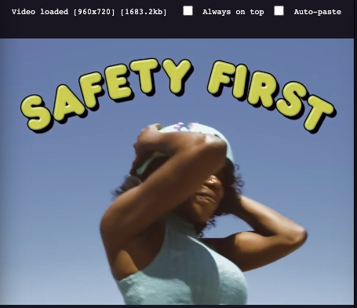

# Veditbox

An utility video edit box for MacOS. It will record audio and paste data or url to be dragged to app.

### &rarr; [Introduction video](https://youtube.com/maykbrito)

## Usage

1. Clone the repository

2. `yarn`

3. `yarn build`

4. Open `dist/mac/veditbox.app`
