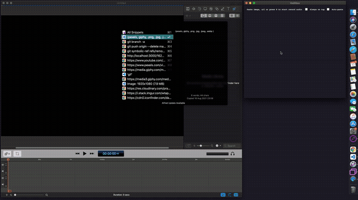

# Veditbox

An Electron utility for MacOS to help us to drag a media (image, audio or video) to any app that accepts drop.

## Features

1. Paste image data or url. Accepts giphy url too
2. Paste video url from instagram, twitter, pexels or .mp4
3. Record audio (presss r to start recording and space to play)
4. Record screen

- Press CTRL + SHIFT + ALT + A to choose display
- CTRL + SHIFT + ALT + S to Start/Stop record

Now you can click and drag the media from the box to any app that accepts drop.

## Usage

1. Clone the repository
2. `yarn`
3. `yarn build`
4. Open `dist/mac/veditbox.app`

## Dependencies

You'll need those installed in your machine

1. yt-dlp
2. ffmpeg
3. ImageMagick

## Inspiration

- https://dev.to/dtinth/pastebox-paste-in-an-image-drag-it-out-as-a-file-41m0
- https://github.com/daltonmenezes/electron-screen-recorder
