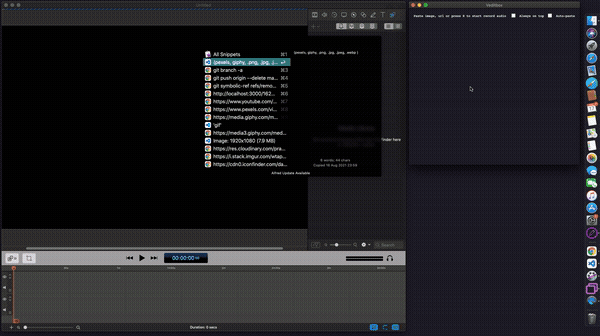

# Veditbox

An Electron utility app for MacOS.

It will help us with video editing.

It will record audio (presss r to start recording and space to play)

You can paste any image data or url - also video from pexels and gif from giphy are accepted; to be dragged to an app.

## Warning

You need youtube-dl and ffmpeg installed on your machine

## Usage

1. Clone the repository

2. `yarn`

3. `yarn build`

4. Open `dist/mac/veditbox.app`

### Inspiration

- https://dev.to/dtinth/pastebox-paste-in-an-image-drag-it-out-as-a-file-41m0
